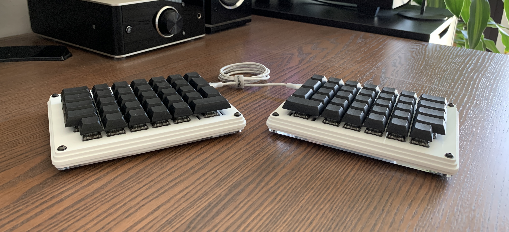
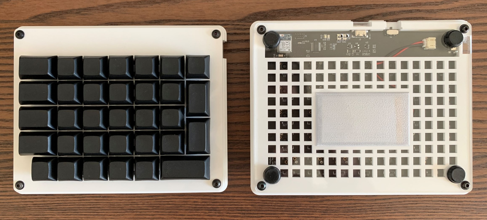

# aW_1 Keyboard

This repository contains the PCB, case design, and firmware for the aW_1 split (semi-)wireless keyboard. The aW_1 layout is a modification of the ErgoDox layout with straightened rows and removed thumb clusters. It is therefore fully compatible with ErgoDox keysets. It is compatible with the [ZMK](https://zmk.dev/) keyboard firmware.

## Design Philosophy
The aW_1 is based on the Nordic NRF52832 that provides both the CPU and bluetooth module in a single chip, which allows for lower power consumption. It can be operated from a standard JST-connected battery, or plugged in via USB-C, which will simultaneously charge the battery. The two keyboard halves are connected with a USB-C cable, hence the "semi"-wireless, with the right half containing most of the circuitry and the left only containing an IO expander. A different approach would be the one pursued by the Mitosis (https://www.reddit.com/r/MechanicalKeyboards/comments/66588f/wireless_split_qmk_mitosis/), which does require a dongle that both halves communicate to. I prioritized the ability to quickly connect the keyboard to laptops, mobile devices, etc. and potential pairing of multiple devices at the same time over cutting the last remaining wire. The connection between the halves is USB-C instead of TRRS because TRRS is not hot-pluggable. Like with an ErgoDox, the there is only a single reversible PCB design for both halves, which makes it cheaper to order. 

## Folder Structure
- `case`: Contains the DXF Files for a low-cost case design built from 5 layers of laser-cut acrylic. 
- `firmware/custom`: Contains a custom firmware implemented with the [Zephyr RTOS](https://www.zephyrproject.org/). The firmware implements all the essential functionality expected of a keyboard firmware (Bluetooth connectivity, layout customization, sleep mode), but lacks some important features (advanced layer config, multiple Bluetooth profiles, etc.). It has mainly served as an educational effort, but for day-to-day usage the ZMK firmware is recommended (see below).
- `firmware/zmk`: Contains the board configuration for the [ZMK](https://zmk.dev/) keyboard firmware. This firmware is recommended for regular use, as it is more stable, customizable, and offers additional features.
- `pcb`: Contains the KiCAD schematics and layout files for the reversible PCB.

## ZMK Setup & Flashing
Due to the [very strict licensing requirements of ZMK](https://zmk.dev/docs/development/clean-room), the board configuration for the GPL-licensed aW_1 cannot be added to ZMK's main repository. Fortunately, flashing the firmware is still a relatively simple process:

1. Setup ZMK locally by following its [Toolchain Setup](https://zmk.dev/docs/development/setup) guide. Let `{zmk}` be the local folder that you have cloned the ZMK main repository into. 
2. Copy the `firmware/zmk/aW_1` folder from this repository into `{zmk}/app/boards`.
3. Switch to the `{zmk}/app` folder and run `west build -b aW_1`.
4. Install the [Nordic nRF Command Line Tools](https://www.nordicsemi.com/Products/Development-tools/nrf-command-line-tools) (including the separate install of the [Segger drivers for J-Link](https://www.segger.com/downloads/jlink/#J-LinkSoftwareAndDocumentationPack) on MacOS and Linux). 
5. Connect the keyboard to your computer with your choice of [Segger J-Link](https://www.segger.com/products/debug-probes/j-link/).
6. Run `west flash` in the `{zmk}/app` directory.

That's it! Your keyboard should now show up as a Bluetooth device. If not, try restarting the keyboard by switching the power switch off and on again. 